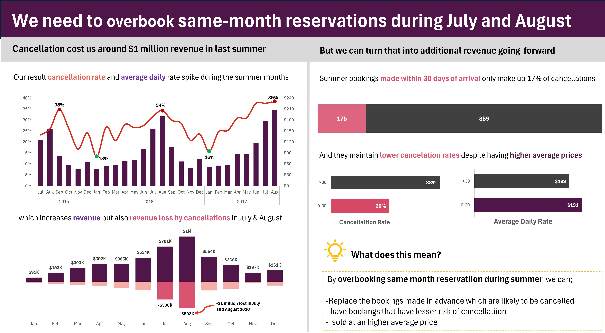
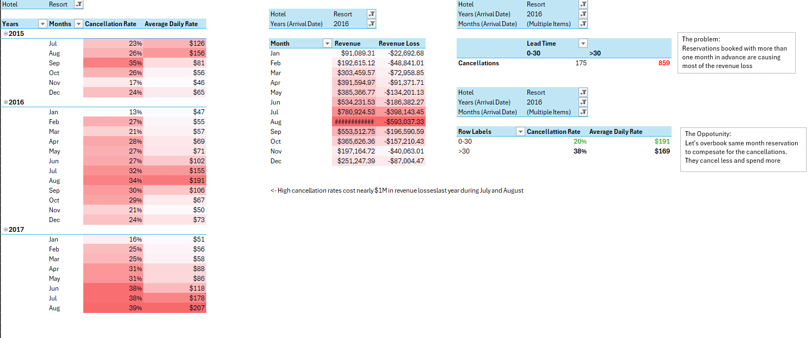

# Hotel Revenue Optimization Analysis

## Executive Summary

A resort hotel was experiencing significant revenue loss due to reservation cancellations during peak summer periods. This project analyzed more than 119,000 booking records to understand cancellation patterns, quantify the financial impact of cancellations, and identify opportunities to improve revenue performance.

The analysis found that cancellations during July and August resulted in approximately **$1 million in lost revenue**. Reservations made within 30 days of arrival had substantially lower cancellation rates and higher average daily rates than reservations made further in advance.

Based on these findings, a controlled overbooking strategy was recommended to compensate for expected cancellations and maximize revenue during peak demand periods.

---

## Quick Access

📊 **Excel Analysis Workbook**  
[Open Workbook](Hotel_and_Resort_Data_by_Adekunle_Ibrahim_Oyesola.xlsx)

📄 **Raw Dataset**  
[View Dataset](hotel_bookings.csv)

📷 **Executive Dashboard**  
[View Dashboard](Hotel_Dataset_Dashboard_By_Adekunle_Ibrahim_Oyesola.jpg)

📷 **Supporting Analysis**  
[View Analysis](Hotel_Dataset_Analysis.png)

---

## Dashboard Preview

---

## Business Problem

Hotels often accept reservations months before a guest's arrival date. While advance bookings help forecast demand, they also introduce uncertainty because customers may cancel before arrival.

For this resort, cancellation rates increased significantly during the summer season, raising concerns about lost revenue and underutilized room capacity.

### Business Question

**How can the resort reduce revenue losses caused by cancellations while maintaining high occupancy and profitability during peak periods?**

---

## Dataset Overview

The dataset contains historical hotel reservation records collected between 2015 and 2017.

### Key Attributes

- Hotel type
- Arrival date
- Lead time
- Booking status
- Average Daily Rate (ADR)
- Reservation details
- Customer information
- Cancellation records

The dataset contains over **119,000 booking records**, providing sufficient data to analyze booking trends, pricing patterns, cancellation behaviour, and revenue performance.

---

## Tools and Techniques Used

### Tools

- Microsoft Excel
- Pivot Tables
- Pivot Charts
- Conditional Formatting
- Dashboard Development

### Analytical Techniques

- Exploratory Data Analysis (EDA)
- Trend Analysis
- Revenue Analysis
- Segmentation Analysis
- Business Intelligence Reporting

---

## Data Preparation

The dataset was cleaned and transformed in Excel to support analysis and dashboard reporting.

Key preparation activities included:

- Reviewing data quality and structure
- Creating calculated metrics
- Preparing data for pivot table analysis
- Organizing data for visualization and reporting

---

## Exploratory Data Analysis

### Monthly Cancellation Trends

Cancellation rates were analyzed across multiple years to identify seasonal patterns.

The results showed a consistent increase in cancellation rates during summer months, particularly July and August.

In August 2017, the cancellation rate reached approximately **39%**, representing the highest observed level in the analysis.

This indicated that the resort's greatest revenue risk occurred during periods of highest demand.

---

### Average Daily Rate (ADR) Trends

ADR was examined alongside cancellation rates to understand the relationship between pricing and demand.

The analysis revealed that room rates increased significantly during summer months, reflecting stronger customer demand.

While higher demand generated greater revenue opportunities, elevated cancellation rates reduced the hotel's ability to fully capture this revenue.

---

### Revenue Impact Analysis

| Month | Estimated Revenue Loss |
|--------|----------------------|
| July 2016 | ~$398,000 |
| August 2016 | ~$593,000 |

Combined revenue losses during these two months approached **$1 million**.

---

### Lead Time Analysis

Reservations were divided into two groups:

- Bookings made within 30 days of arrival
- Bookings made more than 30 days before arrival

| Lead Time | Cancellation Rate |
|------------|------------------|
| 0–30 Days | 20% |
| More than 30 Days | 38% |

Reservations made further in advance were nearly twice as likely to be cancelled.

---

### Pricing Analysis

The Average Daily Rate was compared across lead-time segments.

| Lead Time | Average Daily Rate |
|------------|------------------|
| 0–30 Days | $191 |
| More than 30 Days | $169 |

Bookings made closer to arrival generated higher average revenue while also exhibiting lower cancellation risk.

This suggests that replacing cancelled advance reservations with short-notice bookings could improve both occupancy and revenue.

---

## Key Insights

- Cancellation rates increase significantly during peak summer months.
- July and August represent the highest revenue-risk periods.
- Summer cancellations resulted in approximately $1 million in lost revenue.
- Reservations made more than 30 days in advance account for most cancellations.
- Short lead-time reservations have lower cancellation rates.
- Short lead-time reservations generate higher average daily revenue.
- Existing booking policies may be limiting revenue opportunities during peak demand periods.

---

## Business Recommendation

Implement a controlled overbooking strategy during July and August based on historical cancellation patterns.

The recommendation is supported by three observations:

1. A predictable proportion of advance reservations are cancelled before arrival.
2. Last-minute reservations have lower cancellation rates.
3. Last-minute reservations generate higher average daily revenue.

Potential benefits include:

- Recovering revenue lost through cancellations
- Increasing occupancy rates
- Improving revenue per available room
- Capturing additional high-value bookings during peak periods

This approach should be implemented using historical cancellation benchmarks and monitored closely to avoid excessive overbooking.

---

## Supporting Analysis

---

## Skills Demonstrated

- Data Cleaning
- Exploratory Data Analysis (EDA)
- Excel Analytics
- Pivot Tables
- Data Visualization
- Revenue Analysis
- Customer Behaviour Analysis
- Dashboard Development
- Business Intelligence
- Data Storytelling
- Strategic Recommendation Development

---

## Author

**Ibrahim Oyesola Adekunle**
